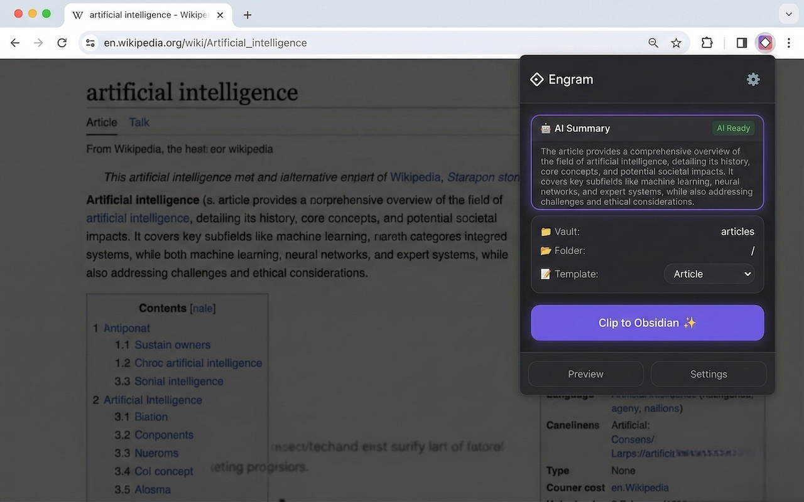
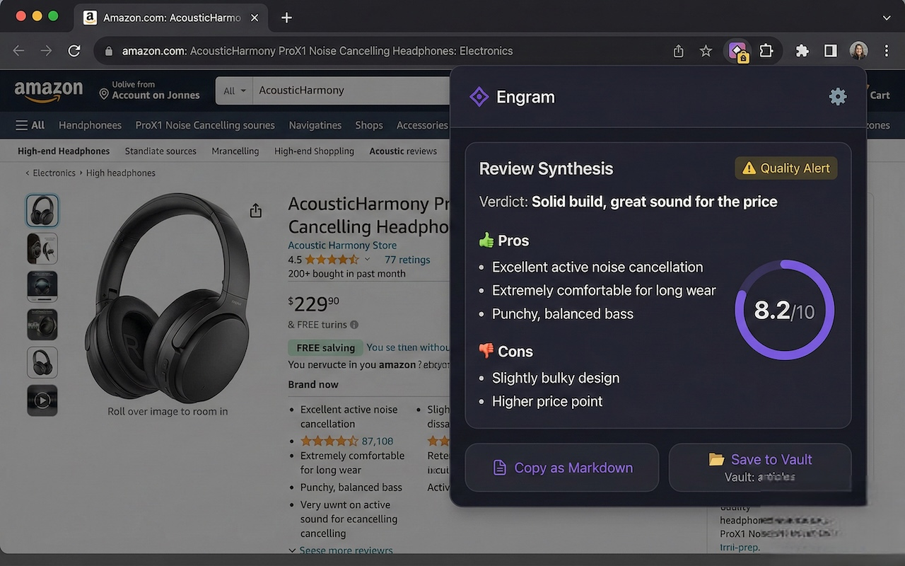
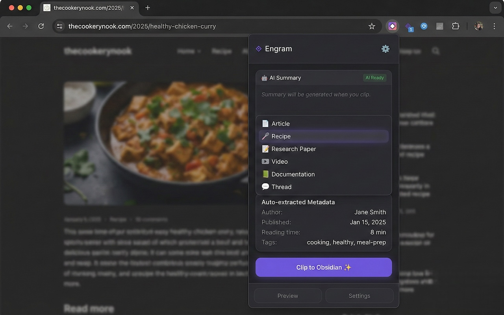
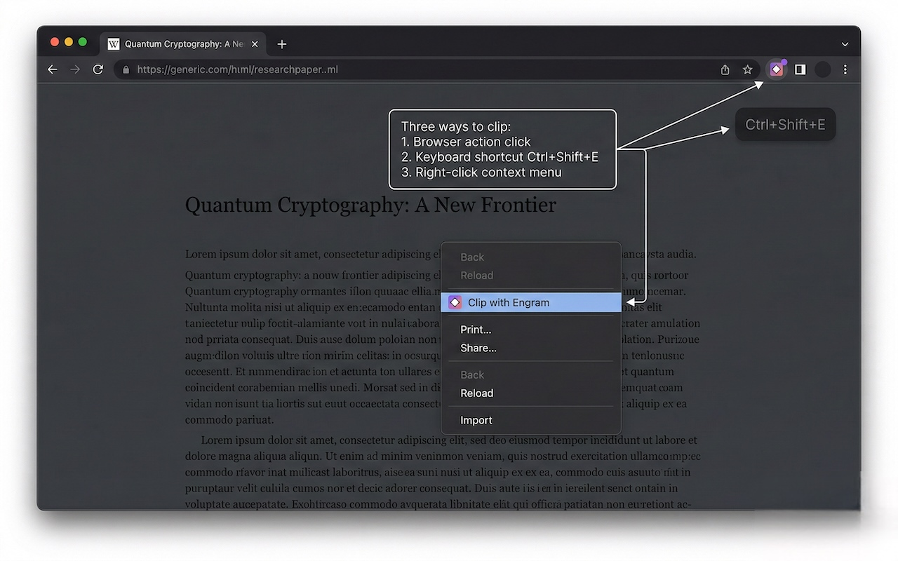

# Engram

Local-first AI web clipper browser extension - clip, summarize, and organize web content directly to markdown files without sending data to the cloud.

## Screenshots

<table>
  <tr>
    <td width="50%" align="center">
      
      <br>
      <b>AI Summary</b>
      <br>
      <sub>Summarize any article with on-device AI</sub>
    </td>
    <td width="50%" align="center">
      
      <br>
      <b>Review Synthesis</b>
      <br>
      <sub>Analyze Amazon reviews with pros, cons & sentiment score</sub>
    </td>
  </tr>
  <tr>
    <td width="50%" align="center">
      
      <br>
      <b>Smart Templates</b>
      <br>
      <sub>Auto-extract metadata with pre-built templates</sub>
    </td>
    <td width="50%" align="center">
      
      <br>
      <b>Multiple Clip Methods</b>
      <br>
      <sub>Browser action, keyboard shortcut, or context menu</sub>
    </td>
  </tr>
</table>

## Features

- **One-Click Article Clipping** - Browser action, keyboard shortcut (Ctrl+Shift+E), context menus
- **Local AI Processing** - Uses Chrome's built-in Gemini Nano for summaries and analysis
- **Review Synthesis** - Analyze Amazon product reviews and get AI-powered pros/cons/quality alerts
- **Direct File Saving** - Save markdown files directly to any folder using File System Access API (works great with Obsidian, Logseq, or any markdown-based workflow)
- **Smart Templates** - Pre-built templates for articles, recipes, research papers, videos, documentation, threads
- **Metadata Extraction** - Auto-detect author, published date, reading time, tags
- **Clip History** - View past clips with live status tracking, remove individual items, or clear all. History is stored exclusively in `chrome.storage.local` on-device. **No clip history is ever sent to a cloud server or third-party service.**

## Review Synthesis

When you visit an Amazon product page, Engram automatically detects it and offers to synthesize reviews:

1. **Detection** - A shopping badge appears on the extension icon when on Amazon product pages
2. **Synthesis** - Click "Synthesize Reviews" to analyze up to 20 reviews using progressive AI batching
3. **Structured Output** - Get a verdict, pros/cons list, sentiment score, and quality alerts
4. **Export** - Copy as markdown or save directly to your vault

Supported pages:

- Amazon product pages (`amazon.*/dp/...`) — all regional domains (`.com`, `.co.uk`, `.de`, `.fr`, `.es`, `.it`, `.co.jp`, `.com.br`, `.com.tr`, `.in`, etc.)
- Amazon review pages (`amazon.*/product-reviews/...`)

## Tech Stack

- [WXT](https://wxt.dev/) - Web Extension framework
- [React](https://react.dev/) - UI library
- [TypeScript](https://www.typescriptlang.org/) - Type safety
- [Tailwind CSS](https://tailwindcss.com/) - Styling
- [@mozilla/readability](https://github.com/mozilla/readability) - Article extraction
- [Turndown](https://github.com/mixmark-io/turndown) - HTML to Markdown conversion
- [DOMPurify](https://github.com/cure53/DOMPurify) - HTML sanitization

## Project Structure

```
engram-web-extension/
├── src/
│   ├── entrypoints/
│   │   ├── background.ts      # Service worker - context menus, commands, badge
│   │   ├── content.ts         # Content script - article/review extraction
│   │   ├── popup/             # Extension popup UI
│   │   │   ├── App.tsx
│   │   │   ├── App.css
│   │   │   ├── index.html
│   │   │   ├── main.tsx
│   │   │   └── style.css
│   │   └── options/           # Options page UI
│   │       ├── App.tsx
│   │       ├── index.html
│   │       ├── main.tsx
│   │       └── style.css
│   ├── components/            # React UI components
│   │   ├── HistoryView.tsx      # Clip history list view
│   │   ├── HistoryItem.tsx      # Individual history entry
│   │   ├── ReviewSynthesis.tsx  # Review synthesis results panel
│   │   ├── Spinner.tsx          # Loading states
│   │   └── ...
│   ├── hooks/                 # React hooks
│   │   ├── useClipOrchestration.ts # Clip flow orchestration
│   │   ├── usePopupInit.ts        # Popup initialization
│   │   ├── useHistory.ts         # History state & storage listener
│   │   ├── useReviewSynthesis.ts  # Review synthesis orchestration
│   │   ├── useVault.ts
│   │   ├── useClip.ts
│   │   └── useAI.ts
│   ├── lib/                   # Core logic
│   │   ├── ai.ts              # AI session management & synthesis
│   │   ├── history.ts         # Clip history (chrome.storage.local)
│   │   ├── prompts.ts         # Centralized AI prompts
│   │   ├── reviewExtractor.ts # Amazon review extraction
│   │   ├── extractor.ts       # Article extraction
│   │   ├── markdown.ts        # Markdown generation
│   │   ├── storage.ts         # Browser storage
│   │   └── filesystem.ts      # File System Access API
│   └── assets/
├── public/
│   └── icon/              # Extension icons
├── bun.lock
├── wxt.config.ts          # WXT configuration
├── tsconfig.json          # TypeScript configuration
└── package.json
```

## Development

```bash
# Install dependencies
bun install

# Start development server (Chrome)
bun run dev

# Start development server (Firefox)
bun run dev:firefox

# Build for production
bun run build

# Create zip for distribution
bun run zip
```

## Requirements

- Chrome 127+ (for Gemini Nano AI features)
- Node.js 18+ or Bun

## Local AI Setup

Engram uses **Chrome's built-in Prompt API (Gemini Nano)** for on-device summarization/tagging. This is **optional** — the extension works without AI enabled.

Chrome sometimes won't download the model until the relevant flags are enabled and you manually trigger the component update. The steps below walk you through enabling the flags and forcing the model download.

### 1) Enable the Chrome flags

1. Open Chrome and go to `chrome://flags`
2. In the search box, enable these flags:
   - `chrome://flags/#prompt-api-for-gemini-nano` → **Enabled**
   - `chrome://flags/#optimization-guide-on-device-model` → **Enabled BypassPerfRequirement**
     - If you don't see "BypassPerfRequirement", pick **Enabled**
3. Click **Relaunch** (or fully quit and reopen Chrome).

### 2) Download the on-device model via chrome://components

1. Open `chrome://components`
2. Find **Optimization Guide On Device Model**
3. Click **Check for update**
4. Keep Chrome open while it downloads (this can take a while and may require multiple minutes; the model can be several GB depending on your Chrome version).
5. When the status shows it's up to date, **restart Chrome** one more time.

### 3) Verify the model is installed (recommended)

- **Check internal status UI**:
  - Open `chrome://on-device-internals`
  - Look for **Model Status** and confirm it's downloaded/ready

- **Check in DevTools console**:
  - Open DevTools → Console and run:

```javascript
await LanguageModel.availability({ languages: ['en'], outputLanguage: 'en' });
```

If your Chrome exposes the older API instead, you can also run:

```javascript
await window.ai?.languageModel?.capabilities();
```

You should see **`"available"`** once the model is ready. If you see **`"downloadable"`**, go back to `chrome://components` and click **Check for update** again.

### Troubleshooting

- **"Optimization Guide On Device Model" is missing in `chrome://components`**:
  - Ensure both flags above are enabled, then restart Chrome and check again.
- **Availability stays "unavailable"**:
  - Confirm you're on **Chrome 127+**
  - Use **Enabled BypassPerfRequirement** for `#optimization-guide-on-device-model`
  - Restart Chrome after the component finishes downloading
- **The model download never starts**:
  - Keep Chrome open on `chrome://components` and try **Check for update** again after a minute
  - Check `chrome://on-device-internals` → **Model Status** for progress/errors

## License

MIT
